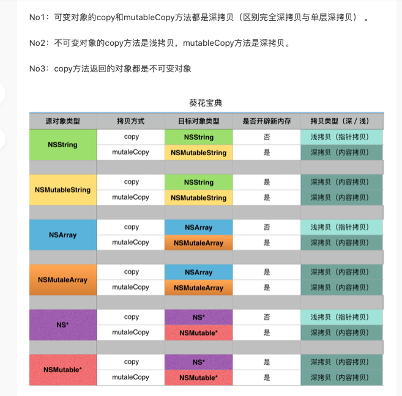

# 沸腾厂面试题

1. socket通信 如何保活

   > REF：[IM 即时通讯之链路保活](https://zhuanlan.zhihu.com/p/83406944)，以下回答摘自该文章。

   **链路保活的必要性**

   基于 TCP 的 Socket 连接建立之后，如果不做任何处理，这个连接会长时间存在并且可用吗？答案是否定的。原因有两点： 

   一、默认 Socket 连接无法及时探测到链路的异常情况，即使将 Socket 的属性参数 keepAlive 设置为 true 仍然无法及时获取到链路存活状态。这是因为 Socket 的连接状态是由一个状态机进行维护的，连接完毕后，双方都会处于建立状态。假如某台服务器因为某些原因导致负载超高，无法及时响应业务请求，这时 TCP 探测到的仍然是连接状态，而实际上此链路已经不可用了。 
   
   二、国内运营商的 NAT 超时机制会把一定时间内没有数据交互的连接断开，这个时间可能只有几分钟，远无法满足我们的长连接需求。
   
   
   
   **通用保活机制-心跳机制**
   
   * 通用保活机制-心跳机制，客户端每隔一段时间给服务器发送一个很小的数据包，根据能否收到服务器的响应来判断链路的可用性。为了节省流量，这个包一般非常小，甚至没有内容，但是应用退到后台可能会被杀掉，这是个问题；
   
   * 消息链路作为收发消息的主要通道，需要最大程度保障链路的可用性。在链路不可用或者异常断开时，能及时探测并启动重连等保障机制。基于以上特性，消息链路除了前面所说的心跳机制外，还另外维护了两套链路优化机制：复合连接机制和重连机制。 复合连接机制的基本步骤如下：
   
     1. 客户端连接导航服务器，导航服务器会下发应用对应的配置信息，其中包括连接服务器的地址列表。
   
     2. 客户端从第一个服务器地址尝试连接，并启动超时机制，如果连接失败或没有及时收到服务响应, 则继续尝试连接下一个直到成功连接，将成功连接的地址保存到本地，作为最优地址，后面连接时优先使用此地址。通过这种机制，能保障客户端优先选用最优链路，缩短连接时间。

> 重连机制，则是指业务层在检测到与服务器的连接断开后，尝试 N 次重新连接服务器，首次断开 1 秒后会重新连接，如果仍然连接不成功，会在 2 秒后（重连间隔时间为上次重连间隔时间乘 2 ）尝试重新连接服务器，以此类推当尝试重连 N 次后，仍然连不上服务器将不再尝试重新连接，只有在网络情况发生变化或重新打开应用时才会再次尝试重连。
>
> *注意避免出现大量终端并发重连，建议客户端重连加上防抖策略，网关层负载也加上相应的缓冲策略*

2. 讲一讲 MVC 中 三者之间的关系

   略

3. 说一下面向对象编程

   略

4. copy 和 strong修饰 block有什么区别

   block本身是像对象一样可以retain，和release。但是，block在创建的时候，它的内存是分配在栈上的，而不是在堆上。他本身的作于域是属于创建时候的作用域，一旦在创建时候的作用域外面调用block将导致程序崩溃。因为栈区的特点就是创建的对象随时可能被销毁,一旦被销毁后续再次调用空对象就可能会造成程序崩溃,在对block进行copy后，block存放在堆区.

   retain strong copy 都是具有将栈上 block 赋值到堆上的操作，strong 和 copy 区别是前者会对堆上block对象引用计数+1。

   通常声明 block 的作用域基本都是在栈上，如果只是作为函数传参变量，不持有它，在函数内部调用一次的话是没问题的，但是一旦函数作用域结束，你还想继续使用的话那么最好将block对象 copy 到堆上，建议最好声明为 copy。

   Block 有三种类型：

   * **NSMallocBlock** ：存放在堆区的 Block

   * **NSStackBlock** ： 存放在栈区的 Block

   * **NSGlobalBlock** ： 存放在全局区的 Block

   Block 内部没有引用外部变量，Block 在全局区，属于 GlobalBlock；Block 引用了外部变量就是一个栈 Block，对于分配在栈区的对象，我们很容易会在释放之后继续调用（假设错用 assgin 或者 weak ），导致程序奔溃，所以我们使用的时候需要将栈区的对象移到堆区，来延长该对象的生命周期。

   MRC： 使用 copy 修饰关键字来将栈上 block 复制到堆上；

   ARC： 使用 strong 和 copy 效果同上；

   

5. copy 和 strong修饰 可变和不可变 数组有什么区别

   可以简单记下图，

   

6. 除了gcd还用过什么  nsoperation有哪些优点  gcd如何控制线程数 gcd的栅栏 还可以用什么代替

   > 可前往某智能物联网公司面试题中的 [多线程的使用 有哪些方式优缺点解答](https://github.com/colourful987/2020-Read-Record/blob/master/topics/面经解题集合/某智能物联网公司面试题.md#4多线程的使用-有哪些方式-优缺点)

7. 做过推送吗 推送的原理是什么 推送如何定位每个手机的

   > 解答参考自[iOS 推送原理](https://www.jianshu.com/p/f35d6ebe2948)

   

   Provider是指你应用程序的Push服务器（可以是第三方推送服务提供商），APNS是Apple Push Notification Service的缩写，是苹果的服务器。

   上图可以分为三个阶段：

   第一阶段：Provider把要发送的消息、目的iPhone的标识（这个标识是要从APNS去获取的）打包，发给APNS。

   第二阶段：APNS在自身的已注册Push服务的iPhone列表中，查找有相应标识的iPhone，并把消息发送到iPhone。

   第三阶段：iPhone把发来的消息传递给相应的应用程序，并且按照设定弹出Push通知。

   

   从上图我们可以看到：

   1. 应用程序注册消息推送。

   2. iOS从APNS Server获取device token，应用程序接收device token。

   3. 应用程序将device token发送给PUSH服务端程序。

   4. 服务端程序向APNS服务发送消息。

   5. APNS服务将消息发送给iPhone应用程序。

   无论是iPhone客户端和APNS，还是Provider和APNS，都需要通过证书进行连接。注意这里应用程序打包的时候有push Notification相关证书。

   

8. 如何分析崩溃日志

   通常最简单的就是使用苹果提供的解析脚本 symbolicatecrash 进行崩溃解析，崩溃中都是地址符号，所以我们需要借助 dSYM 文件进行映射，将地址转成对应的符号，方便我们定位和排查问题，所以对于 UIKit 或者自己集成的第三方库只要你有 dSYM 文件也是可以解析出来的。

   ```shell
   export DEVELOPER_DIR=/Applications/Xcode.app/Contents/Developer
   ./symbolicatecrash crash.log xxx.app.dSYM > result.log
   ```

   还有一种就是 `xcrun atos` 但是这个工作量大一些：

   ```shell
   xcrun atos -o AppName.app.dSYM/Contents/Resources/DWARF/AppName -l 0x1000d8000 0x000000010011a8b0 -arch arm64
   ```

   